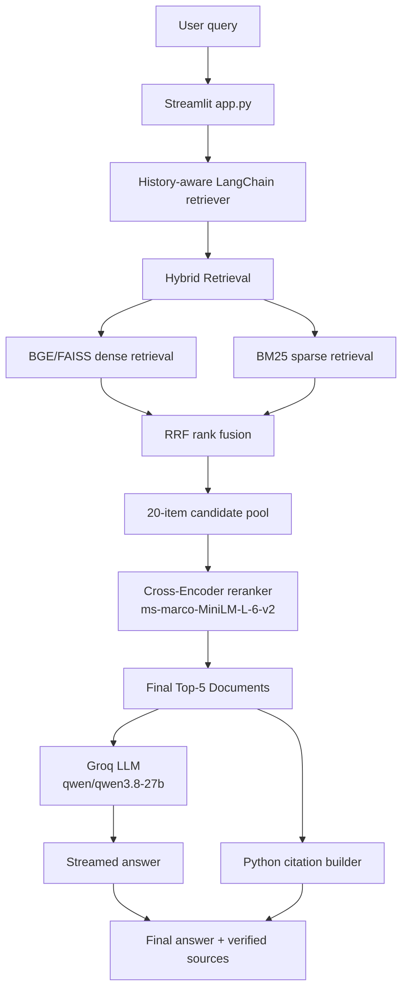
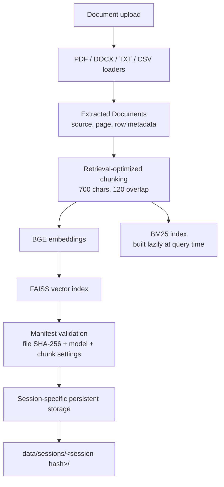

# DocMind AI

[](https://www.python.org/)
[](https://streamlit.io/)
[](https://www.langchain.com/)

## Table of Contents

- [Overview](#overview)
- [Key Results](#key-results)
- [Architecture](#architecture)
- [Features](#features)
- [Tech Stack](#tech-stack)
- [Project Structure](#project-structure)
- [Getting Started](#getting-started)
- [Evaluation Methodology](#evaluation-methodology)
- [Testing](#testing)
- [Limitations / Roadmap](#limitations--roadmap)
- [Contributing](#contributing)
- [License](#license)

## Overview

DocMind AI is a Streamlit-based Retrieval-Augmented Generation (RAG) application for question answering over user-provided documents. Users upload PDF, DOCX, TXT, or CSV files and ask questions in a conversational interface; the application retrieves relevant chunks and supplies them as context to a Groq-hosted language model.

The system combines dense and sparse retrieval, rank-based fusion, and cross-encoder reranking before generation. Answers are streamed to the UI, while source citations are generated programmatically from the metadata of the documents actually supplied to the model, helping reduce unsupported answers and fabricated references.

## Key Results

The latest verified retrieval evaluation reports the following results over **6 test questions**:

| Strategy | Hit Rate@5 | MRR@5 |
|---|---:|---:|
| BGE | 0.5000 | 0.2917 |
| BM25 | 0.5000 | 0.3667 |
| Hybrid | 0.5000 | 0.3750 |
| Hybrid + Cross-Encoder Reranker | 0.5000 | 0.5000 |

Hit Rate@5 remained 50% across all tested strategies. MRR improved from 0.2917 with BGE to 0.5000 with Hybrid + Cross-Encoder Reranking, meaning reranking improved the position of relevant results without increasing top-5 retrieval coverage.

## Architecture

### Query-Time Architecture



At query time, the production adapter calls `HybridRetriever.retrieve(mode="hybrid_rerank", k=5)`. The final five LangChain `Document` objects are passed to the generation chain and are also captured from its streamed `context` for programmatic citations.

### Document Ingestion and Indexing



Uploaded files and persistent FAISS state are stored beneath a hashed session directory. The manifest records the source-file hashes, embedding model, and chunk settings so unchanged indexes can be reused while additions, removals, or modifications trigger the existing rebuild path.

## Features

### Ingestion

- PDF ingestion with `PyPDFLoader` and one-indexed page metadata.
- DOCX ingestion with `Docx2txtLoader`.
- TXT ingestion with `TextLoader`.
- CSV ingestion with `CSVLoader` and row metadata.
- Multiple documents per session.
- Retrieval-optimized recursive chunking with 700-character chunks and 120-character overlap.
- CSV row packing before splitting to avoid excessive micro-chunks.

### Retrieval

- **BAAI/bge-small-en-v1.5:** normalized dense document and query embeddings.
- **FAISS:** dense similarity search over the session's indexed chunks.
- **Persistent FAISS:** local index and manifest reuse across reruns.
- **BM25 / `rank-bm25`:** sparse lexical retrieval over the same chunk set.
- **Reciprocal Rank Fusion:** combines dense and sparse rankings without mixing incompatible raw scores.
- **Cross-encoder reranking:** rescoring of the fused candidate pool using `cross-encoder/ms-marco-MiniLM-L-6-v2`.
- **Top-5 production context:** the five final reranked chunks are supplied to generation.

### Generation

- Groq-hosted generation through `langchain_groq.ChatGroq`.
- Current model: `qwen/qwen3.8-27b`.
- Streaming responses through LangChain and Streamlit `st.write_stream`.
- Grounded generation instructions that restrict factual answers to retrieved context.
- Programmatic source citations built from the final generation Documents rather than LLM-generated metadata.

### Session Management

- Session-specific document storage under `data/sessions/<session-hash>/pdfs/`.
- Session-specific FAISS indexes and manifests under each session directory.
- Separate session document sets prevent cross-session retrieval.
- Session-keyed upload widgets prevent uploader state from crossing sessions.
- Identical uploaded bytes are skipped on reruns.
- Manifest and file hashes prevent unnecessary re-indexing when documents are unchanged.
- Chat history remains managed separately by session ID in `data/chat_histories.json`.

### Evaluation

- Hit Rate@5.
- Mean Reciprocal Rank@5.
- Comparison of BGE, BM25, Hybrid, and Hybrid + Cross-Encoder retrieval.
- PDF page and CSV row ground-truth checks.

    - Session-specific document storage under `data/sessions/<sha256(session_id)[:32]>/pdfs/`.
    - Session-specific FAISS files under `data/sessions/<sha256(session_id)[:32]>/faiss_index/`.
    - Session-specific manifests at `data/sessions/<sha256(session_id)[:32]>/faiss_index/manifest.json`.
- Terminal logging through the centralized `docmind` logger.
- Rotating local file logging at `logs/docmind.log`.
- Existing application session IDs in log context.
- Component-based records for App, Session, Upload, Indexer, Retriever, Generator, Citations, and related stages.
- Indexing, retrieval, and generation latency metrics.
- INFO, DEBUG, WARNING, and ERROR levels.
- Bounded/sanitized session and filename values in log output.

## Tech Stack

| Category | Technologies |
|---|---|
| Language | Python |
| Frontend | Streamlit |
| LLM | Groq `qwen/qwen3.8-27b` |
| Embeddings | `BAAI/bge-small-en-v1.5` via `HuggingFaceBgeEmbeddings` |
| Vector Search | FAISS (`faiss-cpu`) |
| Sparse Retrieval | BM25 via `rank-bm25` |
| Reranking | `sentence-transformers` Cross-Encoder |
| Document Processing | `pypdf`, `docx2txt`, LangChain document loaders |
| Framework | LangChain chains, retrievers, prompts, and `RunnableWithMessageHistory` |
| Persistence | Local FAISS files, JSON manifest, SHA-256 file hashes |
| Evaluation | Hit Rate@5 and MRR@5 |
| Testing | Python test scripts and deterministic persistence checks |

## Project Structure

```text
docmind-ai/
├── app.py                         # Streamlit application and session UI
├── README.md                      # Project documentation
├── requirements.txt               # Python dependencies
├── backend/
│   ├── __init__.py
│   ├── chunking.py                # Retrieval-oriented document chunking
│   ├── citations.py               # Programmatic source citation formatting
│   ├── faiss_store.py             # Persistent FAISS and manifest handling
│   ├── generator.py               # Groq LLM setup and answer streaming
│   ├── hybrid_retrieval.py        # Dense, BM25, RRF, and reranking
│   ├── logging_config.py          # Centralized console/file logging
│   ├── rag_pipeline.py            # LangChain conversational RAG chain
│   └── retriever.py               # Loaders, embeddings, storage, and indexing
├── evaluation/
│   ├── evaluate.py                # Retrieval evaluation runner
│   ├── mrr.py                     # Reciprocal-rank metrics
│   └── test_questions.py          # Six evaluation questions and ground truth
├── tests/
│   ├── test_chunking.py            # Ingestion and chunking invariants
│   └── test_faiss_persistence.py  # Persistence and hash-change checks
├── data/                          # Local runtime data; ignored by Git
│   ├── chat_histories.json        # Saved conversation histories
│   ├── faiss_index/               # Existing local runtime index directory
│   ├── pdfs/                      # Existing local runtime document directory
│   └── sessions/                  # Active per-session documents and FAISS state
└── logs/                          # Local rotating application logs
```

## Getting Started

### Clone the repository

```bash
git clone https://github.com/Moinak07/docmind-ai.git
cd docmind-ai
```

### Create a virtual environment

Windows:

```bash
python -m venv venv
venv\Scripts\activate
```

### Install dependencies

```bash
pip install -r requirements.txt
```

### Configure environment variables

Create a local `.env` file in the project root:

```env
GROQ_API_KEY=your_groq_api_key_here
HF_TOKEN=your_huggingface_token_here
```

`GROQ_API_KEY` is required for generation. `HF_TOKEN` is optional: the current code forwards it to the Hugging Face environment when provided, but does not require it to configure the embedding model. Do not commit `.env` or expose either credential.

### Run the application

```bash
streamlit run app.py
```

Then open the local URL displayed by Streamlit.

### Use the application

1. Enter the Groq API key in the sidebar and apply it.
2. Select or enter a session ID and apply the session.
3. Upload PDF, DOCX, TXT, or CSV documents.
4. Ask questions about the documents.
5. Review streamed answers and their source citations.

## Evaluation Methodology

The evaluation runner in `evaluation/evaluate.py` uses six ground-truth questions: four PDF questions and two CSV questions. Each strategy retrieves the top five results and is scored by whether the expected source/location/content appears in those results and by the reciprocal rank of the first matching result.

The compared strategies are:

1. BGE dense FAISS retrieval.
2. BM25 sparse retrieval.
3. Hybrid dense + BM25 retrieval with RRF.
4. Hybrid retrieval followed by cross-encoder reranking.

Evaluation commands should be run from the repository root with the required dependencies installed:

```bash
python evaluation/evaluate.py
```

## Testing

Run the existing deterministic tests from the repository root:

```bash
python tests/test_chunking.py
python tests/test_faiss_persistence.py
```

`test_chunking.py` checks supported-format ingestion, chunk-size/overlap invariants, and source/page/row metadata preservation. `test_faiss_persistence.py` checks manifest creation, file-hash change detection, index reload behavior, metadata round-tripping, and rebuild handling for missing or corrupt persistence.

For the complete interactive workflow, run the Streamlit app and test uploads, session switching, repeated questions, citations, and document changes with a configured Groq API key.

## Limitations / Roadmap

- Local document and FAISS storage is tied to the running application workspace; it is not a multi-process or cloud storage service.
- The application depends on text extraction from uploaded files; scanned image-only PDFs require OCR support that is not currently included.
- Generation requires a valid Groq API key and network access to the Groq service.
- Retrieval evaluation currently uses six questions, so the reported metrics are a small benchmark rather than a general quality guarantee.
- The current evaluation and runtime persistence are local-file based rather than backed by a hosted database or vector service.

## Contributing

1. Create a focused branch for your change.
2. Keep retrieval, generation, persistence, and UI changes scoped to their owning modules.
3. Run the existing tests and relevant evaluation commands from the repository root.
4. Update this README when supported behavior or configuration changes.
5. Open a pull request with a concise description of the change and validation performed.

## License

No license file is currently included in the repository. Add an explicit license before distributing the project under open-source terms.
